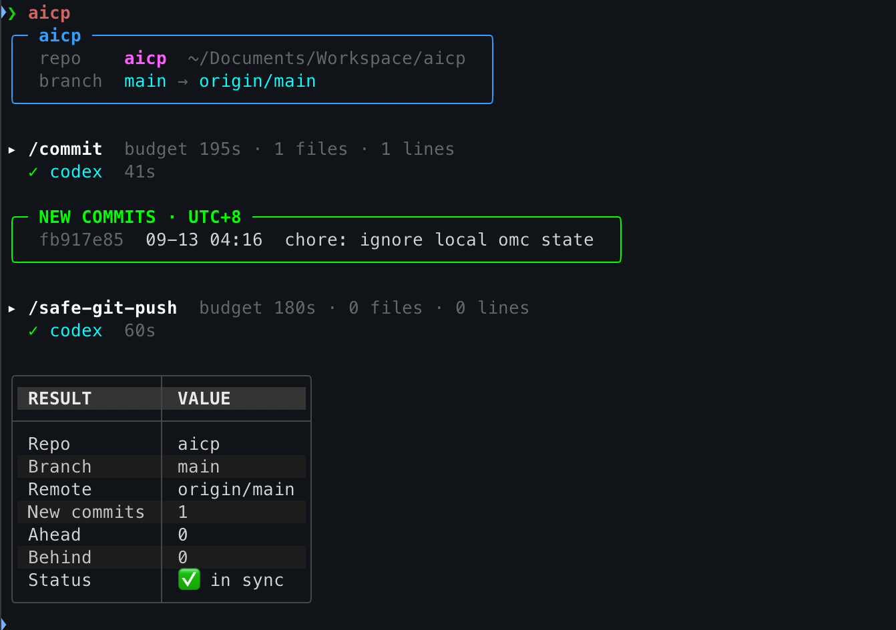

# aicp

AI commit + push, with a git-verified result summary.

`aicp` runs an AI coding CLI to write your commit message(s) and push, walking
a fallback chain until one exits 0; anything not installed is skipped. It
sends that CLI two literal prompts, `/commit` then `/safe-git-push`.

**The chain is yours to arrange, and it isn't a fixed set.** The built-in
registry ships six CLIs — `copilot`, `agy`, `codex`, `claude`, `vibe`,
`grok` — but that's only the default *order*, not a hardcoded pipeline. Move
any one of them to the front with `aicp --swap-ai`, set the whole order from
`aicp --config` or `AICP_CLI_ORDER`, and add your own CLIs (or drop built-in
ones) with `aicp --agents`. Every agent in the resolved registry is a
first-class link in the chain — there is no privileged first CLI and no cap
on how many you run with.

The part that matters: **aicp never trusts the CLI's own account of what
happened.** An AI CLI can print "pushed!" and exit 0 while `/safe-git-push`
quietly aborted inside it. So every number in the result summary — new
commits, ahead/behind, whether the branch is actually in sync — is read back
from `git` itself after the CLI is done, never taken from its output. A
failed `git fetch` is never read as "already in sync" either: a stale
remote-tracking ref resolves just fine and would otherwise report a clean
push that never reached the remote.

## Contents

**Getting started**

- [Requirements](#requirements)
- [Install](#install)
- [Set up skills](#set-up-skills)
- [Run it](#run-it)

**Using it**

- [Fallback order](#fallback-order) — reorder the chain, `--swap-ai`
- [Fallback results and quota limits](#fallback-results-and-quota-limits)
- [`--undo`](#--undo) — take back the last commit
- [Automation / CI](#automation--ci) — the non-interactive flags

**Reference**

- [Configuration](#configuration) — every setting and env var
- [Custom agents](#custom-agents) — add your own AI CLI
- [Safety](#safety) — the pre-commit secret scan
- [Platform support](#platform-support) — macOS, Linux, Windows

## Requirements

- Python 3.10 or newer
- [`uv`](https://docs.astral.sh/uv/) — the install path below
- `git`
- At least one AI CLI from the chain on `PATH` (a built-in one, or your own
  via [Custom agents](#custom-agents))

The Python package itself has no runtime dependencies.

## Install

```sh
uv tool install aicp-cli             # latest release
uv tool install aicp-cli==X.Y.Z      # pin to a specific version
```

The distribution is [`aicp-cli`](https://pypi.org/project/aicp-cli/); the command
it installs is `aicp`. (The plain
`aicp` name on PyPI belongs to an unrelated 2021 project — don't install it.)
Replace `X.Y.Z` with the release version you want; re-running either command
switches an existing install to that version.

```sh
uv tool upgrade aicp-cli
uv tool uninstall aicp-cli
```

When a newer release is on PyPI, aicp asks after the command finishes:
**Update now** (runs `uv tool upgrade aicp-cli`), **Skip** (ask again next
run), or **Skip until next version**. Off a terminal (CI, pipes) it prints a
one-line hint instead. Turn it off with the **Check for updates** row in
`aicp --config`.

The mechanism lives in `src/aicp/update_check.py`, stdlib-only, so other
projects can copy it: `offer(started, ask, cache_path=..., upgrade=[...])`
acts on the answer, and `ask(found)` is the only part that depends on the UI.

## Set up skills

```sh
aicp --config   # -> Skills
```

`/safe-git-push` only means something if a skill by that exact name exists in
the CLI's own config directory — otherwise the CLI receives a slash command it
has never heard of and improvises. aicp ships and installs that skill for you,
but it never overwrites a skill you already have: a file with no aicp version
marker next to it is treated as yours and left alone. `/commit` is always left
to your existing definition.

Targets follow each CLI's own config directory, not its binary name — `agy`
(this project's name for the Gemini CLI) reads `~/.gemini`, not `~/.agy`:

| CLI | Config dir | `/commit` installed? | `/safe-git-push` installed? |
| --- | --- | --- | --- |
| `claude` | `~/.claude` | No — keeps your existing `commands/commit.md` | Yes |
| `codex` | `~/.codex` | Yes | Yes |
| `copilot` | `~/.copilot` | Yes | Yes |
| `agy` (Gemini CLI) | `~/.gemini` | Yes | Yes |
| `vibe` | `~/.vibe` | Yes | Yes |
| `grok` | `$GROK_HOME` when set, otherwise `~/.grok` | Yes | Yes |

Every configured CLI gets `/safe-git-push`. `/commit` is installed everywhere
*except* `claude`, which already resolves `/commit` from
`commands/commit.md` — a second definition under `skills/` would compete with
it. Which skills an agent gets is data, not a branch: it's the `skills` field
of that agent's registry entry, so a [custom agent](#custom-agents) declares
its own list the same way.

The vendored text is rewritten per CLI on install — the shipped copy talks
about `.claude/` and `CLAUDE.md`, which mean nothing to `codex` or `agy`, so
each install substitutes that agent's own `config_dir` name and `memory_file`.

A CLI whose config directory doesn't exist at all is skipped, never created —
aicp only ever installs into a CLI you've actually set up.

## Run it

The whole command surface is two things to remember:

```sh
aicp             # commit, then push
aicp --config    # settings, skills, health check, import/export — everything else lives here
```

A plain `aicp` run: checks whether anything is pending (skipping the AI CLI
entirely on a clean, already-in-sync repo), scans for secrets, runs `/commit`
through the fallback chain, then `/safe-git-push` the same way, then prints
the git-verified result table described above. `-v`/`--verbose` streams each
CLI's raw output live instead of showing a spinner.

Every long flag also works without its leading `--` — `aicp config` is the
same as `aicp --config`.



`aicp --config` is one menu for everything that isn't "commit and push
right now": which steps run, message language, fallback CLI order, the
skills install/upgrade view, a health check, and — see below — saving or
loading those settings as a file.

### Fallback order

The order is a saved preference, not a property of the tool. Three ways to
set it, all writing the same `aicp_cli_order` key:

```sh
aicp --swap-ai   # pick a CLI, it trades places with whoever holds #1
aicp --config    # the AI CLI order row, arrow keys
```

```sh
# ~/.aicp/config.json — or AICP_CLI_ORDER="claude codex" aicp for one run
{ "aicp_cli_order": "claude codex copilot agy vibe grok" }
```

`--swap-ai` is a rotation, not a destructive set: the CLI you pick moves to
`#1` and the old `#1` takes its place, so nothing falls out of the chain. It
lists every agent in the registry, including ones whose binary isn't on
`PATH` — a missing binary must not hide a choice you're about to install.
Naming only the first few is enough; everything you leave out is appended
behind them in registry order.

### Fallback results and quota limits

The opening run panel prints the resolved chain, and the commit panel and
final RESULT table name the CLI that handled each step (`—` when skipped).
When a CLI emits a supported, exact quota/rate-limit signal, aicp records the
outcome as `quota`, notifies through the usual notification path, and excludes
that CLI from the rest of that one commit/push flow. The exclusion also
persists: the CLI stays skipped for `AICP_QUOTA_COOLDOWN` seconds (default one
hour, state in `~/.aicp/quota.json`), because a token or rate-limit wall
normally stands for hours and every run inside that window would otherwise burn
a full budget per step on a CLI that cannot succeed. A skipped CLI prints how
long is left; `AICP_QUOTA_COOLDOWN=0` switches the cooldown off entirely, and
deleting the file clears it.

Only the `quota` outcome starts a cooldown. A timeout does not — a CLI that
hangs on its rate limit instead of exiting is indistinguishable from one merely
running long, and sidelining it for an hour on that guess costs more than the
retry does.

Exact detection is intentionally narrow. It is supported for Codex, Claude,
Vibe, and Grok only; Copilot, `agy` and any agent you add yourself have no
verified quota signature, so a nonzero exit from those remains an ordinary
failure and is still eligible for the next step.

### `--undo`

```sh
aicp --undo
```

Runs `git reset --soft HEAD^` on the last commit — the escape hatch for a bad
commit message or a wrong stage. Changes land back in the index, not lost,
not pushed. It never calls an AI CLI and refuses outright (HEAD untouched) in
four cases, because once a commit reaches the remote other clones or CI may
already be building on it:

- there's no branch to compare against (detached `HEAD`),
- there's no parent commit to reset onto,
- the last commit is already on the remote,
- the remote can't be verified at all (deleted remote, failed fetch, never
  pushed) — "can't verify" is treated as the risky case, never as "safe."

## Automation / CI

Everything below is a non-interactive escape hatch for scripting; day-to-day
use is the two commands above.

```sh
aicp --doctor --json          # skill-install status for every configured CLI, as JSON
aicp --install-skills --yes   # install what's missing, upgrade what's outdated
aicp --install-skills --force # also replace files aicp doesn't recognize
aicp --agents                 # the agent registry; see Custom agents for its verbs
```

`--doctor --json` reports, per CLI and per skill: the target path and whether
it's missing, current, an outdated aicp copy, someone else's file, or the CLI
itself isn't configured — the same view `--config`'s Skills screen shows,
without a terminal.

`--install-skills --yes` installs anything `MISSING` and upgrades anything
older than the version aicp ships, exactly like the interactive Skills view —
and it **never** touches a file aicp doesn't recognize. Only `--force` does
that, and even then the original is moved aside to `<name>.bak` (numbered
`.bak.1`, `.bak.2`, … so a second forced install never clobbers the first
backup) before aicp writes its own copy.

### Releasing

`.github/workflows/release.yml` runs on a `v*` tag. It repeats the full
lint/test/build pass, installs the wheel into a throwaway venv, and refuses to
upload unless that wheel reports the version being tagged — so a tag that
disagrees with `pyproject.toml` fails before anything reaches PyPI. It then
publishes with Trusted Publishing (OIDC — there is no API token stored in this
repo) and attaches the wheel, sdist and `SHA256SUMS` to the GitHub release.

Checksums are generated *after* publishing on purpose: `uv publish` uploads
everything in `dist/`, and `SHA256SUMS` is not a distribution.

A tag runs the workflow file **as it existed at that tag**, so a release that
failed to publish can't be repaired by re-running the old tag — the fix isn't
in that tree. Bump the version and tag again.

## Configuration

Agent definitions live in [`src/aicp/agents.json`](src/aicp/agents.json),
bundled with the installed package. Both `aicp` and `aicp --config` use this
registry for executable lookup, invocation arguments, config directories,
and skill installation/status. To maintain an agent, edit its entry here.
Registry order supplies the default fallback order; `aicp_cli_order` still
controls the user's preferred order.

Use `~/` paths and bare executable names for entries shared across macOS,
Linux, and Windows. Python resolves `~` to the native home directory
(`USERPROFILE` on Windows); forward slashes work on all three systems.
Absolute paths are specific to the host OS; in JSON, a Windows path can use
`C:/Users/name/.codex` or escaped backslashes (`C:\\Users\\name\\.codex`).
Executable lookup uses `PATH` and, on Windows, `PATHEXT`; the runner handles
both native executables and `.cmd`/`.bat` launchers. CI runs the registry
integration tests and installed-wheel checks on all three operating systems.

| Agent field | Meaning |
| --- | --- |
| `executable` | Binary name resolved on `PATH`, or an absolute executable path. Separate from the stable agent ID used in fallback order and history. |
| `config_dir` | Absolute path or `~/`-relative directory; home is resolved when used. |
| `config_dir_env` | Optional environment variable overriding that directory (currently `GROK_HOME`). |
| `skills_dir` | Relative directory inside `config_dir` where skills are installed. |
| `skills` | Which vendored skills to install for this agent — any of `safe-git-push`, `commit`. Omitting `commit` is how `claude` keeps its own `commands/commit.md`. |
| `memory_file` | Instruction filename used when adapting vendored skill text. Project directory references use the basename of `config_dir`. |
| `args` | Argument array containing exactly one standalone `{prompt}`, replaced with the complete prompt as one argument. No shell evaluation. |

The JSON envelope has `version: 1` and an `agents` object keyed by stable
agent IDs. Future supported settings can be added to each entry and the
loader; adding a JSON field alone does not implement new behavior.
Invocation defaults preserve agy's `--new-project` (use the current working
directory), vibe's `--trust` (avoid an interactive trust prompt), and the
existing MCP startup suppression flags.

This is packaged application data, not a per-user override file. Package
upgrades replace it; neither repository-local files nor
`~/.aicp/config.json` can override agent execution settings. Ordinary user
preferences continue to use the config file below.

### Custom agents

You can add agents that are not in the built-in registry — or suppress
built-in ones — without touching the bundled `agents.json` (which package
upgrades replace). Your changes live in `~/.aicp/agents.json`, which aicp
merges over the built-in registry at startup: your entries win on conflict,
and an entry with `"disabled": true` removes that agent from the chain.

You don't have to write that file by hand. `aicp --agents` edits it for you,
and so does the **Agents** row of `aicp --config`:

```sh
aicp --agents                                   # list every agent and where it came from
aicp --agents disable grok                      # drop one from the chain
aicp --agents enable grok                       # put it back
aicp --agents set claude executable=/opt/claude # override one field
aicp --agents reset claude                      # forget your override
```

Like every other flag, the leading `--` is optional: `aicp agents disable grok`.

Nothing is written unless the resulting registry passes the same validation
the next run does, so a typo is refused with the file left exactly as it was —
`aicp` can never be edited into a state where it won't start. Disabling an
agent also removes it from a saved `aicp_cli_order`, because an order naming
an agent that no longer resolves is rejected *in full*, which would silently
reset a fallback order you picked on purpose. The last remaining agent can't
be disabled.

**Adding a new agent** — example: [MiniMax](https://www.minimaxi.com/) CLI.
Every field is required for a name the built-in registry has never heard of:

```sh
aicp --agents set minimax \
  executable=minimax \
  config_dir='~/.minimax' \
  memory_file=AGENTS.md \
  skills_dir=skills \
  skills=safe-git-push \
  'args=--prompt,{prompt},--yes'
```

`skills` and `args` are comma-separated; a value that needs a literal comma
has to go into the file by hand. The equivalent written out:

```json
{
  "version": 1,
  "agents": {
    "minimax": {
      "executable": "minimax",
      "config_dir": "~/.minimax",
      "memory_file": "AGENTS.md",
      "skills_dir": "skills",
      "skills": ["safe-git-push"],
      "args": ["--prompt", "{prompt}", "--yes"]
    }
  }
}
```

A new agent joins the end of the fallback chain automatically. To put it
first, use `aicp --swap-ai`, the AI CLI order row of `aicp --config`, or set
the order yourself:

```sh
# ~/.aicp/config.json
{ "aicp_cli_order": "minimax copilot agy codex claude vibe grok" }
```

Or as an environment variable, for one run:

```sh
AICP_CLI_ORDER="minimax claude" aicp
```

For an agent that already exists, only the fields you provide are overridden;
unspecified fields keep the built-in values. Running the chain only needs the
`executable` on `PATH`, same as any built-in agent (see
[Fallback results](#fallback-results-and-quota-limits)); `config_dir` matters
for skill installation — a newly added agent whose `config_dir` doesn't exist
yet is skipped there until you set it up.

The config file lives at `~/.aicp/config.json` (override the path itself
with `AICP_CONFIG`, which — being the thing that names the file — can only be
set as a real environment variable). Precedence everywhere is
**environment > `config.json` > hardcoded default**. The file is a JSON
object, parsed as data and never sourced or eval'd, written atomically and
owner-only (`0600`) by `--config`/`--swap-ai`; only keys matching
`AICP_[A-Z0-9_]*` case-insensitively with a **string** value built from
letters, digits and `` / . _ : @ + - `` survive — everything else (an unknown
key, a non-string value, a value outside that charset) is skipped
individually, so one bad key never costs the rest of the file. An invalid
*value* for a known key never aborts a run — it's reported on stderr and
falls back to the default.

`aicp` always **writes** keys `lower_case` (`aicp_do_commit`, not
`AICP_DO_COMMIT`) — every key in [`config.example.json`](config.example.json)
and any new knob added in the future follows the same convention. Reading is
case-insensitive, so an existing file with `AICP_`-cased keys still works.

A legacy `~/.aicprc` (the pre-JSON `KEY=value` format) is migrated into
`~/.aicp/config.json` automatically, once, the first time `aicp` runs — the
old file is left in place untouched, never deleted or rewritten.

See [`config.example.json`](config.example.json) for a ready-to-copy template.

The **Import/export settings** row of `aicp --config` saves the same JSON
object to a file you name, or loads one written by another machine — same
merge/skip rules as above (a denylisted or malformed key is named and left
out, everything else already in `config.json` is kept). There are no secrets
in this file to filter: `aicp` stores none.

| Variable | Default | What it does |
| --- | --- | --- |
| `AICP_DO_COMMIT` | `1` | Run the `/commit` step. `0` = only push what's already committed. |
| `AICP_DO_PUSH` | `1` | Run the `/safe-git-push` step. `0` = commit and stop. |
| `AICP_LANG` | `en` | Message language: `en` or `zh-TW`, everywhere including notifications. |
| `AICP_CLI_ORDER` | registry order (`copilot agy codex claude vibe grok` out of the box) | Fallback order, space-separated. A prefix is enough — any agent left out is appended after it, in registry order, so adding an agent never invalidates an order you already saved. An unknown or repeated name is refused outright and the default order is used. |
| `AICP_TZ` | `Asia/Taipei` | IANA zone name used to render commit timestamps. Anything else falls back to the default. |
| `AICP_TZ_LABEL` | `UTC+8` | Cosmetic label shown beside those timestamps; not validated. |
| `AICP_STEP_TIMEOUT` | *(unset)* | Pins every CLI's per-step budget in seconds, skipping the formula and history below entirely. |
| `AICP_TIMEOUT_BASE` | `180` | Budget floor (seconds) — covers cold start plus a small prompt. |
| `AICP_TIMEOUT_PER_FILE` | `15` | Seconds added per changed or untracked file. |
| `AICP_TIMEOUT_PER_100L` | `5` | Seconds added per 100 changed lines in tracked files. |
| `AICP_TIMEOUT_MAX` | `1800` | Ceiling on the formula above. A CLI's own run history may still widen its budget past this — that's direct evidence it legitimately needs the time, not a guess. |
| `AICP_TIMEOUT_HISTORY_LINES` | `500` | How many recent timing-log rows are scanned when widening a budget from history. |
| `AICP_TIMEOUT_HISTORY_MULT` | `1.3` | Multiplier applied to a CLI's largest successful run when that exceeds the formula. |
| `AICP_QUOTA_COOLDOWN` | `3600` | Seconds a CLI that reported a quota/rate-limit signal stays skipped, across runs (state in `~/.aicp/quota.json`). `0` switches the feature off; anything not a plain integer in 1..604800 falls back to the default. |
| `AICP_SKIP_SECRET_SCAN` | *(unset)* | `1` bypasses the pre-commit secret scan for one run — the documented escape for a false positive. |
| `AICP_CONFIG` | `~/.aicp/config.json` | Which file this loader reads. Environment-variable only — a file can't rename itself. |
| `AICP_TIMING_LOG` | `~/.aicp/timing.log` | Where per-CLI timing rows are appended (rotated at 5 MB, 5 kept). **Environment-variable only** — refused if set in `config.json`. |
| `TG_BOT_TOKEN` | *(unset)* | Telegram bot token used to send the end-of-run notification — sent directly to the Bot API via stdlib HTTP (`aicp.telegram_notify`), no external script or project required. Same name `~/.claude/scripts/tg-send.sh` already uses, so an existing setup carries over. Not part of the `AICP_*` config system at all (see below), so it can only ever be a real environment variable. |
| `TG_CHAT_ID` | *(unset)* | Telegram chat to notify. Same rules as `TG_BOT_TOKEN`. |

Either `TG_BOT_TOKEN` or `TG_CHAT_ID` missing (or the request failing) just
means the notification prints to the terminal instead — nothing about the
commit/push run itself depends on it.

`AICP_TIMING_LOG` is refused from `config.json` on purpose: it names a path
that then gets *written and rotated* (`mkdir -p` / `>>` / a rename). A config
file is exactly the kind of thing that can arrive synced from someone else's
dotfiles repo, so anything that becomes a filesystem sink stays a
real-environment-only decision — set it in your shell, not the file.
(`TG_BOT_TOKEN`/`TG_CHAT_ID` don't need this treatment: they aren't
`AICP_`-prefixed, so `config.json` was never able to supply them to begin
with.)

## Safety

Before any AI CLI runs, aicp scans everything the run *could* commit for
likely secrets: the added lines of the pending diff, every tracked file git
reports as binary, and every untracked file — since aicp never runs `git add`
itself, a brand-new file with a pasted secret is exactly the case that would
otherwise slip through unscanned. A hit **stops the run before any AI CLI is
called**, and only ever prints the file, line number and the pattern's name —
never the matched text itself, so a real secret can't reach your terminal,
a log, or a Telegram notification through this path.

Seven fixed patterns are checked (OpenAI-style `sk-…` keys, GitHub PATs and
App tokens, AWS access key IDs, bearer tokens, and PEM private-key blocks) —
deliberately prefix/format checks only, with **no entropy heuristic**: that
was tried and rejected upstream as the main source of false positives (this
project's own API-key-shaped test fixtures tripped it). A false positive is
bypassed once with `AICP_SKIP_SECRET_SCAN=1`.

A file the scanner can't read as text — genuinely binary, or a UTF-16 `.env`
full of NUL bytes — is never silently skipped: it's reported as "not
scanned, verify manually" so an unreadable file never reads as a clean one.

## Platform support

Tested in CI on macOS, Linux, and Windows, full test suite on all three — no
platform is a reduced or best-effort target.

| Platform | Notes |
| --- | --- |
| macOS | No caveats. |
| Linux | No caveats. |
| Windows | Every AI CLI ships as an npm `.cmd`/`.bat` shim, which Windows can't launch directly (`CreateProcess` doesn't honor `PATHEXT` and can't run a batch file itself) — aicp resolves the real executable and, for a shim, launches it through `cmd.exe` itself rather than `shell=True`, so no user-controlled text ever builds a shell command line. Ctrl+C is forwarded as `CTRL_BREAK_EVENT` rather than delivered directly (Windows has no "foreground process group" concept), so a CLI that ignores that signal may not stop as cleanly as it would elsewhere. |

On POSIX, a per-CLI timeout signals the CLI process itself, not any
grandchildren it spawned. On Windows, terminating the intermediate `cmd.exe`
can orphan the CLI behind the shim; that high-priority defect remains open in
[TODO.md](TODO.md). Ctrl+C still targets the Windows process group.

## License

MIT — see [`LICENSE`](LICENSE).
